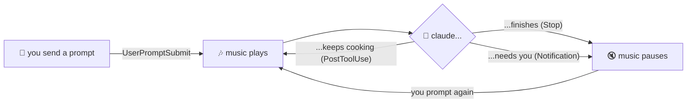

<div align="center">

# 🧑‍🍳 lethimcook

### your AI is cooking. this is the kitchen soundtrack.

**claude code plays theme music while it thinks — pauses the moment the dish is served.**

<br/>


<br/>

*claude thinking* 🧠 → 🎶 *music plays* → *claude stops* 🛑 → 🔇 *silence. instantly.*

</div>

---

## 💭 the lore

you prompt claude. it starts cooking. you sit there watching a spinner like it's 2009.

**what if the spinner had a theme song?**

lethimcook hooks into claude code's lifecycle and plays
[**"Claude's Plan" by Jeff Guo**](https://www.youtube.com/watch?v=9kT0oLBPiOw)
(or literally any mp3 you want) while claude is thinking. when claude finishes,
asks for permission, or waits on you — the music **pauses**. when claude locks
back in — it **resumes from the exact same spot**. no restarts. no chaos.
the song always plays through and only loops when it naturally ends.

it's giving *main character energy* to your terminal. fr.

## ⚡ get it running (one click, no cap)

> you need python 3.8+. that's it. that's the dependency.

**1.** clone it / download it / yoink the folder

```bash
git clone https://github.com/YOUR_USERNAME/lethimcook.git
```

**2.** run the setup for your OS

| your machine | do this |
|:---:|:---|
| 🪟 windows | double-click **`setup.bat`** |
| 🍎 macos | `bash setup.sh` |
| 🐧 linux | `bash setup.sh` |

**3.** restart claude code. prompt something. vibe. ✨

<sub>the setup auto-installs pygame, grabs the song if it's missing (needs ffmpeg
for that one step), and wires the hooks into `~/.claude/settings.json` with paths
for *your* machine. run it again anytime — it cleans up after itself and never
touches your other settings (backs them up to `settings.json.bak` first, we're
not monsters).</sub>

## 🧠 how it actually works



two tiny scripts, zero background clutter:

- **`scripts/player.py`** — a hidden daemon. loads your mp3 with pygame, loops it
  forever, and polls a state file 5×/sec to pause/unpause. pausing keeps the
  playback position — that's the secret sauce. a lock + heartbeat file guarantee
  **exactly one** player ever runs, even with multiple claude sessions open.
  goes touch grass (exits) after 2 hours of silence.
- **`scripts/hook.py`** — what the hooks call. writes `play` or `pause` to the
  state file, spawns the daemon if needed, exits in milliseconds. every hook is
  async so your claude stays **zero-latency**.

<details>
<summary>📋 <b>full hook table</b> (for the nerds — click)</summary>
<br/>

| claude code event | action | translation |
|---|:---:|---|
| `UserPromptSubmit` | ▶️ | you said something, claude's cooking (lifts a hard stop) |
| `PostToolUse` | ▶️ | tool finished, still cooking (ignored after a hard stop) |
| `PostToolUseFailure` | ▶️ | tool flopped, claude's coping + cooking |
| `PermissionDenied` | ▶️ | you said no, claude's pivoting |
| `Notification` | ⏸️ | claude needs you. pick up the phone |
| `Stop` | 🛑 | claude's done. **hard stop** — stays silent until you prompt again |
| `SessionEnd` | 🛑 | you left. it noticed. hard stop too |

hooks fire async and out of order, so a straggler `PostToolUse` used to sneak in
*after* `Stop` and un-pause the music. now `Stop`/`SessionEnd` drop a hard-stop
flag that mutes every resume attempt — only your next prompt lifts it.

</details>

## 🖱️ prefer buttons? the control panel

not a terminal person? there's a little window for all of this — play/pause,
mute, volume, change song, install, and uninstall — no commands required.

| your machine | do this |
|:---:|:---|
| 🪟 windows | double-click **`controls.bat`** |
| 🍎 macos / 🐧 linux | `bash controls.sh` |
| 🐍 any | `python scripts/gui.py` |

it polls the daemon once a second, so the buttons always show what the music
is *actually* doing — even if a Claude Code session or the CLI changed it.
built on plain tkinter (ships with python), so there's nothing extra to install.

<sub>everything below still works from the command line — the panel just calls
the same actions.</sub>

## 🎛️ make it yours

**volume** — edit `config.json`, applies **live** while the music plays (yes, really):

```json
{ "volume": 100 }
```

**change the song** — drop any mp3 in the root as `thinking-song.mp3`. done.
your thinking music can be phonk, boccherini, or the seinfeld theme. we don't judge.

```bash
# or grab any track off youtube:
python -m yt_dlp -x --audio-format mp3 -o "thinking-song.%(ext)s" <url>
```

**mute button** — need silence for a bit, but keep it installed? flip it off
(and back on) anytime — no reinstall, applies live even mid-song:

```bash
python scripts/hook.py off    # soundtrack off (sets "enabled": false in config.json)
python scripts/hook.py on     # soundtrack back on at the next prompt
```

<sub>editing `"enabled"` in `config.json` by hand does the same thing —
the player checks it live, just like volume.</sub>

**panic button** — music stuck? get him out of the kitchen:

```bash
python scripts/hook.py quit
```

## 🌐 beyond claude code (cowork & web chat)

the daemon doesn't care who's cooking — `player.py` is a shared audio engine,
and anything that can hit a localhost endpoint can drive it.

| surface | how it's wired | status |
|---|---|:---:|
| 🖥️ claude code | lifecycle hooks (`setup.py` installs them) | ✅ automatic |
| 🤝 cowork (claude desktop) | same harness, same `~/.claude/settings.json` hooks | ✅ automatic* |
| 💬 claude.ai web chat | userscript + local bridge (below) | ✅ automatic |
| 🧩 anything else | call the bridge yourself (`curl` counts) | 🎛️ manual |

<sub>*cowork runs on the claude code harness and reads the same settings file,
so the normal setup covers it. if your cowork build doesn't fire hooks, use
the bridge below as the fallback.</sub>

**the bridge** — a tiny localhost-only http server (stdlib, zero deps) that
translates requests into the exact same play/pause actions the hooks use:

```bash
python scripts/bridge.py        # listens on http://127.0.0.1:48765
```

endpoints: `/play` `/resume` `/pause` `/stop` `/quit` `/on` `/off` `/status`
— same semantics as the hooks (`/stop` is a hard stop: nothing resumes until
the next `/play`; `/off` and `/on` flip the temporary-disable toggle). it binds `127.0.0.1` only and answers web pages only if they
come from `claude.ai`, so neither your network nor random websites can
mess with your music.

**web chat** — install [`extras/claude-chat.user.js`](extras/claude-chat.user.js)
in tampermonkey/violentmonkey, start the bridge, open claude.ai. the script
watches the streaming indicator: claude starts generating → music plays;
response finishes → hard stop. that's the whole wiring.

**manual mode** — no hooks, no userscript, no problem:

```bash
curl -X POST http://127.0.0.1:48765/play    # let him cook
curl -X POST http://127.0.0.1:48765/stop    # dinner's served
```

## 🗑️ uninstall (why would you though)

> just want quiet for a while? use the [mute button](#-make-it-yours) instead —
> `python scripts/hook.py off` — and keep the install.

one command. it removes the hooks from `~/.claude/settings.json` (only ours —
your other settings and hooks are untouched, with a fresh `settings.json.bak`
saved first), shuts down the music daemon, and deletes the temp
state/lock/heartbeat files. idempotent — run it twice, nothing breaks.

| your machine | do this |
|:---:|:---|
| 🪟 windows | double-click **`uninstall.bat`** |
| 🍎 macos / 🐧 linux | `bash uninstall.sh` |
| 🐍 any | `python setup.py --uninstall` |

then restart claude code and delete the folder. no registry gunk, no leftover
daemons, no hard feelings. 💔

## ❓ faq

<details>
<summary><b>does this slow claude down?</b></summary>
<br/>
nope. every hook runs async and exits in milliseconds. the music is a whole
separate process minding its own business.
</details>

<details>
<summary><b>i have multiple claude sessions open. do i get a remix?</b></summary>
<br/>
no — one daemon, one song, shared by all sessions. the lockfile said "one mic only."
</details>

<details>
<summary><b>why does the song resume mid-track instead of restarting?</b></summary>
<br/>
because restarting a banger at 0:00 every 30 seconds is a war crime.
pause/resume preserves position; the track only loops when it fully ends.
</details>

<details>
<summary><b>is the song included in the repo?</b></summary>
<br/>
no — the mp3 is gitignored because it's someone's actual music
(<a href="https://www.youtube.com/watch?v=9kT0oLBPiOw">"Claude's Plan" by Jeff Guo</a>, go stream it).
setup downloads it to your machine for personal use, or you supply your own mp3.
</details>

## 🤝 contributing

PRs welcome. ideas that would go hard:

- 🎚️ different songs for different hook events (boss music for `PostToolUseFailure`?)
- 🔀 playlist folder support
- 🍎 a proper system-tray icon (the [control panel](#-prefer-buttons-the-control-panel) is here — a real menu-bar/tray version would go even harder)
- 🎮 konami code easter egg (we'll figure out where)

---

<div align="center">

**built with ☕, one prompt, and questionable priorities.**

*if this made your terminal 200% more cinematic, drop a* ⭐

<sub>not affiliated with anthropic. claude just deserved a soundtrack.</sub>

</div>
